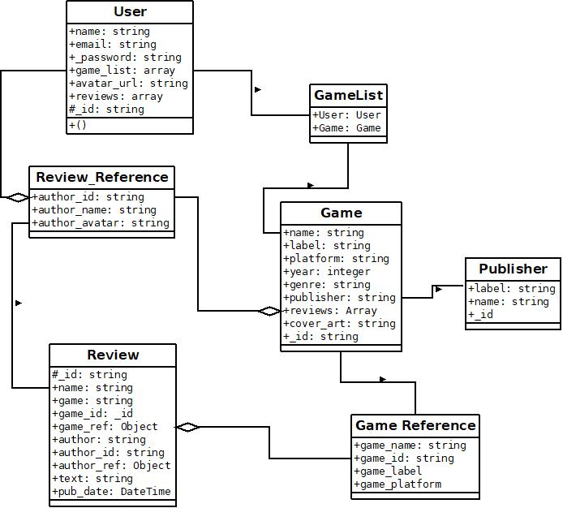

# PlayedIt


---

Find this App [here](https://shouldiplaythisgame.herokuapp.com)

PlayedIt (Also known as ShouldIPlayThisGame, due to restrictions on Heroku) is a toy social network, made with python and flask on the backend. The front-end will use [Bulma](https://www.bulma.io) and JavaScript/JQuery.

A user of PlayIt will be able to login and view a profile page, they will be able to tag games that they have played and leave reviews for those games. These reviews will be short (no more that say 180 characters a la Twitter) and have an liekert scale beside them indicating whether the user loved, liked, was neutral, disliked or hated a particular game. Users will be able to follow the posts of other users and, eventualy, cast votes for the most useful reviews.


As PlayedIt will centre around the connectivity of data (through reviews, users and the games they play) choosing the correct data-model and database will be important. A SQL database is attractive due to its wide support and how common it is. Unfortunately, such a database would not scale well due to the number of joins, many-to-many and one-to-many tables. With PlayedIt we shall use a NoSQL option: [MongoDB](https://www.mongodb.com/).

---

## Table of Contents

1. [Design and Development](#Design-and-Development)
    - [User Stories](#User-Stories)
    - [Strategy](#Strategy)
    - [Scope](#Scope)
    - [Structure](#Structure)
    - [Skeleton](#Skeleton)
    - [Surface](#Surface)

2. [Features](#Features)
    - [Features to be implemented](#Features-to-be-implemented)

3. [Testing](#Testing)
4. [Deployment](#Deployment)
    - [Using Git & Github](#using-git-&-github)
        - [Git](#Git)
        - [Initialising Git](#initialising-git)
        - [Adding Files to Git](#adding-files-to-git)
        - [Git Commit](#git-commit)
        - [Git Remotes](#git-remotes)
        - [Creating and Uploading a Repository](#creating-&-uploading-a-repository)
        - [Git Branch](#git-branch)
    - [Deploying to Heroku](#deploying-to-heroku)
5. [Credits](#credits)

## Design and Development

The approach to design and development will be the one that was devised and popularised by Jesse James Garrett in his book, 'The Elements of User Experience'. Garrett argues User Experience had 5 elements which build upon one another, rather than being separate, independent components. These are: strategy, scope, structure, skeleton, and surface. We will take each of these elements (or planes) in turn.

### User Stories

As the user of this product, I want:

1. To add games I have played
2. To have my own profile page where I can view my games and reviews
3. To view other game pages
4. To see the reviews of other users
5. To edit and personalise my profile page
6. To add reviews of games I have played

As an owner of this product, I want:

1. To have a clean UX which encourages engagement
2. To encourage users to contribute their views
3. To have a means of providing affiliate links to stores or sponsored content
4. To have a means to collect user data


### Strategy

The strategy plane of UX design concerns itself with high-level decisions about the product and trade-offs between features to be developed now and others to be developed later. Compare feasibility of features with importance.

The LEAN model of software design will be adopted here with the identification of a minimum viable product (MVP) which can be released to the public. 'Lean startups' are very _en vogue_ at the present and business types are greater fashion-victims than teenagers. Yet, it makes sense to focus on developing a basic, working product and seek to add features to it. In this regard, we will plot out the different objectives on the basis of feasibility and importance. Importance here will be based on how we perceive each products appeal to the wider public.


#### [INSERT IMPORTANCE/FEASIBILITY GRAPH HERE]


#### _User Needs_

Here we segment our users into different groups, each having a certain characteristic in common. Marketers often segment groups by demographics: age, ethnicity, income level and so on.

The users here will be people who play video games. This is quite a diverse demographic with online survey reporting about 45% of people who play games on regular basis are 35 years and older. Regular game players are still slightly more male than female: 54% to 46% but the gap is closing as games become a more common past-time.

A person who uses this app however will typically be looking for what new games to buy or play. A review of other social apps or websites show there is sufficient demand for guide on what games to play, something that would augment or fit in an interstice between sites such as metacritic and gaming journalism and entirely user-made content such as the ShouldIBuyThisGame sub-reddit.

It is anticipated, due to the nature of gaming, most if not all users will have be proficient in the use of the web and comfortable accessing the app from desktop PC, mobile phone or tablet. In fact, this proficiency will, in part, lead them to expect they can do so. This means that it is important to design a responsive app which can be used on a variety of media. 

Extensive experience of the web also brings with it a set of assumptions about the user experience and design. A navigation bar at the top, a collapsible menu at the top-right on mobile and other common traits of webpages should be deployed to ensure a smooth and comfortable experience.

Most of the users of the site will be experienced hobbyists themselves, given that most gamers are above 35 and will have grown up with the hobby. This means they will have played games on multiple platforms and be familiar with a variety of game genres. The app will appeal to them as they search for the next thing to play. However the usability should appeal to newer consumers or the perplexed (e.g. a partner or relative seeking advice on purchasing a gift).

#### *Personas*

1. Paul: Paul is 36 and works as a professional job. He began playing games from an early age, starting with the Nintendo NES in 1989. Paul is married and has three children. Paul enjoys games and likes to play them to unwind after the children have gone to bed or at weekends. Due to his work and family commitments, the time Paul has for his hobby is scarce and, for him, precious. Unsatisfying or unfulfilling experiences would be a waste of this time. Paul therefore seeks guidance on what games he should choose to suit both his straitened time commitments and ones he will enjoy. He uses metacritic and gaming journalism to help inform his choices but he feels that many of the reviewers are much heavier gamers with much more free time than him. He seeks people in similar situations and with similar tastes.

2. Sarah. 24. Sarah is a teacher and has also played games from a young age. She has an extensive collection of games on multiple platforms. Sarah wants to try to buy fewer games focussing on hgiher quality and enjoyment while also working through her backlog. While she does read news and aggregator sites, Sarah often goes relies on social media to assist her in making these decisions.


### Scope

The scope follows on from the strategy plane. In this plane, we identify the specific requirements of the product and get a firm idea of what we are going to build. Here we focus on developing features in small, incremental blocks until we have a finished or viable product. This permits the realistic budgeting of time and the development of products quickly and effectively. It will also prevent 'project creep'.

#### *What are we going to make?*

A social app which will permit users to add games, add reviews of games and have a profile with those reviews and games.

#### *Requirements*

1. Users will have a profile page which they can personalise.
2. A user's profile will show them a list of their games and a list of the reviews they have posted.
3. A user can browse games and see sample reviews from other users.
4. The system must be scalable, capable of handling at least 1000 users simultaneously.
5. The main page should have a hero image with a callout.
6. Users should be able to browse content.
7. But they must be registered and/or logged in to interact with the app.
8. Users will be able to add games to the app
9. Users will be prevented from deleting games they have added.
10. Users will be able to create reviews of games.
11. Users will be able to edit any reviews they have created.
12. Users can delete any of their reviews.
13. [Add more here] 

##### *Content

- Users will expect:
  - A profile page
  - A profile page which can be personalised
  - A profile page which will show their games
  - A profile page which will show their reviews
  - To be able to browse games
  - To see sample reviews by other users
  - To be able to add games to the app
  - To be able to add reviews to games
  - To be able to remove games from their profile
  - To be able to delete the reviews they have written
  - To be able to edit the reviews they have written
  - To be able to see the profiles of other users

##### *Functions

- The app must be quickly navigable
- The app must be simple to traverse
- The key parts of the app must be easy to find and access
- The app must allow Users to create, read, update and delete in accordance with their expectations

### Structure

Progressing down the planes, the developer moves from the abstract to the concrete as part of the eternal struggle by humanity to make its desires manifest. Does this mean that all developers are closeted Hegelians? Maybe mad platonists? Who knows? You are still reading this. Why?

The structure plane involves the detailing of how each feature will work together in the project.

#### How will we structure this app?

All code should be open for extension and scalability. We should have the ability to add additional features as we progress. Many pain points arise not out of code that does not work but our of code that is not open for extension or which cannot be made to adapt. 

A key aspect of this app will be the data model adopted and deployed. The app will not use a relational database, but rather a document oriented one. In this case, this will be MongoDB and their Database-as-a-Service Atlas. A document store differs from a relational database in that it: 

  1. does not require a schema
  2. does not use rows as the basis for organisation
  3. Is BASE rather than ACID
  4. Is distributed on shards rather than found on a monolithic server

A lack of a schema is double-edged. Extension of the database becomes simpler as there are no concerns about schema migration or rendering existing data invalid with a change. However, such freedom can lead to disordered and disparate data being tossed into a store. So we shall try to fetter the access to the database by using an appropriate separation of concerns. In this case, almost all database operations will be carried out by python classes specified in models.py. Those objects will intermediate between user input and the database, giving a common shape to the db, and will also receive data from the database and ensure it is in order. The classes are all contained in the models.py file in the app folder, and they shall form the basis for any data model.

MongoDB can be slower than certain SQL databases, so from the outset we should seek to optimise our data mopdel by avoiding 'joins'. Joins are where we try to cross-reference data across collections and/or databases. Joins form an integral part of any SQL database and they also become a significant burden once the queries reach a certain level of complexity. MongoDB is similar in that its database structure is split between databases and collections within each database.

Our database will have 4 primary collections: Games, Users, Publishers, Reviews. In my database, I also added a tests collections for testing queries and the data models.




As can be seen from the above, the structure of this data model contains some redundancy in the form of extended references to other documents in addition to references by ObjectId. This is intentional - on another database such redundancy would be problematic and it is not without its problems here. However, it is submitted that the freeform nature of MongoDB and good design of the models will allow for reconciliation of data where a mismatch occurs.

The model I disclose here shows that we have users, who hold data including a list of games and a list of reviews. This connects users to both the Game model and the Review model. In turn each of these contains references to the other models. Games hold a list of relevant reviews, and reviews reference 1 Game and 1 User. Each of these references is an extended reference - it contains data such as name, publisher, etc. in addition to a reference to the ObjectId. This structure permits me to retrieve relevant information with a single query and without having to rely on joins in the data.

The extended Reference 'pattern' is not my invention, but is suggested by MongoDB itself in its [Building with Patterns](https://www.mongodb.com/blog/post/building-with-patterns-the-extended-reference-pattern) series. The authors submit the Extended Reference pattern can be used where there are many joins needed to gather frequently accessed data. They too are concerned about the duplication of data and the decisions one must make when seeking to update the data.

As an interim fix, I have decided to weave the updates of objects together in the app routes and to limit the ability of users to manipulate the database. So while Users may add games to the database (via a form and a model), they may not remove a game from the database. There is not conceptual difficulty with this as games do not contain any personal data or means of identifying the user. Allowing them to delete games, however, would lead to cascading changes, broken links and updates. Rather users may delete their individual reviews and remove certain games from their personal list, they may not remove games globally. A review has a one-to-one relationship with a game and a user. The only User who holds a reference to the game is the User who authored it. An only the User who authored the review has the power to delete it. At the software level, a deletion in this case shall only have direct consequences for that User. 


### Skeleton

Here we begin to design the interface and the navigation of the product. This should be a natural follow-on from above. This is the bit where you figure out how many distinct html files you will need to write, where to put a nav-bar and so on.

The focus of the app will be the main page and the user profile page. From their profile, a user can see their games and their reviews. They can also explore the app by means of a 'browse games' page. Each page offers the opportunity to the user to add content, whether it be a game or a review. A navigation bar at the top of the site allows for a User to return to the home page, their profile page, or the browse games page with a single click. Within the User's profile page there is a tab for their profile, a tab for their games and a tab for their reviews. A User can remove a review by clicking on their Reviews tab, navigating to the edit profile link, and clicking on the large, red, 'delete review' button.

A User must be logged in to use the app features, although some limited browsing while logged out is permitted.

#### *User Interaction

The wireframe for the app is as follows. Interaction centers around the profile page and the game page. Simple forms are used to upload data.


##### *Create

Users create games and reviews by entering data into html forms. These forms are made with a combination of html & css (mainly relying on the [Bulma.io](https://bulma.io/) framework), jinja templates and flask-wtforms. The relevant forms can be found in the templates folder: add_review.html, add_user_review.html.jinja, register.html and add_game.html 

##### *Read

Users can view web pages, the games and reviews they create. These pages are made largely with the Bulma Css framework and Jinja. These include: main.html, review.html.jinja, user.html, user_games.html, user_profile.html, browse_games.html, and game.html. Custom 404 and 500 error pages have also been included so the user can easily navigate to their profile or the main page should they so require.

The Game page updates to include any reviews Users have written about the game, and samples of these reviews are included on the browse games page. Users can view their personal list of games and reviews via their profile page.

###### *Store-Front / Purchase link

The Game page includes a button which directs users to the store-front or to another store (possibly via an affiliate link). This is currently a placeholder, but the link could be set by creating a collection in the database or by using the API of another storefront to locate the relevant game.

##### *Update

Users have the ability to edit their reviews and their profile page. A User's profile page prominently displays an 'Edit Profile' button. From there they are brought to the edit\_profile.html.jinja, which allows them to change their username, if they wish, and write a short bio for their page. Each user must have a unique username and this is verified by the form, which checks the database before validation. A matching username is conveyed to the user by means of an error message. The User's avatar, provided by [Robohash](https://robohash.org) is set to match their unique profile name.

A user may also edit any reviews they have written but may not edit reviews written by other users. Reviews can be edited by clicking on the edit review link when viewing the review card. Users can access these cards from the game page or from their profile. 

##### *Delete

Users may delete any reviews they have written. This can be done from the User's profile page or from the page of the game which was the subject of the review. under each review card is a link that takes you to the 'edit review' form. Beneath that form is another form, displayed to the User as a red button with the words 'Delete Review' written. Unsurprisingly, this form causes the review to be deleted and removed from the User's profile page. 

It is anticipated that an additional feature will allow a user to delete their profile entirely, but this would have cascading effects and would need to be considered carefully. For example, does a User deleting their profile entail a deletion of all their reviews? If so, this would be detrimental to other Users who can view such reviews on the game page or the browse games page. The sudden, unsignalled removal of a review would be a jarring experience for other Users and make their interaction with the app less satisfying. A better approach would be to remove the User's profile but to keep their reviews, perhaps replacing their username with 'deleted\_user'. 

### Surface


#### Security Features

Any app that concerns users logging in, registering, completing forms or otherwise managing their data requires that we deploy security considerations.
This app currently has 3 security features designed to protect the integrity of the app and prevent disruption to user data.

##### *Password Hashing

The trend now is to not store passwords or to write your own home-grown verification procedures but to use 2-factor authentication or authentication  via google, github or microsoft. While a future version of this app shall incorporate 2-factor, the app in its current form will use an email and password login system to manage users and prevent digital vandalism. Passwords, however, will not be stored in plain form. Instead they will be hashed using flask/werkzeug's built in hashing functions. When a user registers, they will enter a password in a string form. This password is then hashed (converted to a string of symbols, letters and digits) and the hash is stored on the database. This mechanism means there is no point, save for intercepting the registration message, where a person could easily discover a password by accessing the database. At login, werkzeug's built in function is able to check whether the password is correct by seeing if the passed string can be used to decode the hash to a message werkzeug understands.


##### *Cross-Site Request Forgery Prevention

Cross-Site Request Forgery or 'CSRF' is when a malicious party intercepts a message between a user and a server and can use that to execute an unwanted action. For example, you log in to your online banking app by clicking on a link sent to you by email. The link is actually sent by a malicious party. They, in turn, use your information to execute a request transferring funds to another bank account. It is a good security practice to prevent CSRF attacks by taking such measures in your flask app.

Flask-WTForms prevents CSRF by attaching a hidden field to each form which contains a 'CSRF token'. This token is a cryptographic hash which is generated based on some hard to forge information. On the server side, running 'form.validate\_on\_submit' will run a check to see if a correct CSRF token is present. If it is not, the form is not validated and the command is not executed.


##### *Session Cookies

Session cookies are needed to allow for users to navigate through the app without having to constantly log in and log out. Sessions, or url parameters, are string that are attached to the end of http requests and which can be used to ascertain the 'state' of a request. These cookies are cryptographically signed which allows a user to see the contents of the cookie but will be unable to modify it. Sessions in this app are used to store a User's username and database '\_id'. They are signed using the Flask secret key which is set as part of a hidden environment variable on the app. 


---

## Features

App:

- [X] User Profile Pages
- [X] User can edit profile pages
- [X] User can add games to app
- [X] User can add reviews to games on app
- [X] User can view a User's reviews on their profile page
- [X] User can edit their reviews
- [X] User can remove games from their profile


### Features to be implemented

- [] Followers

- [] Single Page App

- [] Ability to like reviews

- [] Ability to leave comments on reviews

- [] Multi-factor authentication


---

## Testing

Supporting documentation can be found in the [tests](tests) folder and the [tests.py](tests.py) file.

The nature of the project meant that the code was subjected to extensive unit tests on each individual part.

Unit tests were conducted on the business logic of the application using Python's built in unittest library. These tests are documented and can be seen in tests.py at the top level of Github.

_Tests.py Output (21-10-21):_

```bash

test_add_game (__main__.TestUser) ... ok
test_add_review (__main__.TestUser) ... ok
test_add_user (__main__.TestUser) ... ok
test_check_user (__main__.TestUser) ... ok
test_check_user_email (__main__.TestUser) ... ok
test_class_from_mongo (__main__.TestUser) ... ok
test_class_to_mongo (__main__.TestUser) ... ok
test_game_retrieval (__main__.TestUser) ... ok
test_load_existing_user (__main__.TestUser) ... ok
test_make_user (__main__.TestUser) ... ok
test_password (__main__.TestUser) ... ok
test_update_review (__main__.TestUser)
Test the update function of the update review. ... ok
test_update_user (__main__.TestUser) ... ok
test_user_delete (__main__.TestUser) ... ok

----------------------------------------------------------------------
Ran 14 tests in 11.660s

OK

```

Manual Tests and automated browser tests of the app were carried out.

These tests include:
  * Accessing the app:

      The app was deployed successfully and can be accessed at [shouldiplaythisgame.herokuapps.com](https://shouldiplaythisgame.herokuapp.com/)
  
  * Registering a User:
      
      A User can successfully register and be taken to their profile page. Attempts to enter invalid data or passwords that do not match result in an error message being displayed to the user. Successful registration redirects the User to their new profile and their new custom avatar.
  
  * Logging In:

      The user must enter a valid email and password. An invalid email redirects the user to the registration page (they can navigate back to the login page easily). An invalid password prevents access. In the furture, it would be nice to implement a 'forgot password' feature using email or some form of 2 factor authentication. This will allow the user more feedback when they are logging in. It was not possible to implement such a feature at this time.

  * Logging Out:

    Clicking log out in the top right of the navbar, logs out the user and removes session cookies.

  * Adding a game:

    Users navigate to the my games page from their profile and can add games. Completing the form leads to a successful addition. The game appears on the User's profile and on the 'browse games' page.

  * Adding an existing game:

    The 'browse games' section permits the User to browse existing games and see samples of other User reviews. If a game is not in the User's 'My Games' list, the game's site will display a button bearing the label 'Add This Game' to the User. Clicking this adds the game to their list.

  * Adding a review:

    A user can successfully add a review.  The review appears on their profile page and appears on the game page. A successful addition akes teh User to the review page where the time, title, content, username and avatar can be seen.


  * Editing and Deleting a review:

    Clicking on their reviews in their profile brings the user to a card where they can edit the review. A button beneath the edit form is a link which brings the User to a page stating 'Are you sure?'. Clicking on the button on that page, deletes the review and removes it from the user's reviews.

  * Removing a game from 'My Games':

    Clicking on the 'My Games' section of the review page shows the user a list of games they have added. Clicking on the title of these games brings the User to the games page. A game that is in the User's 'My Games' will display a large, red 'Delete This Game' button. Clicking that, removes the game from the User's 'My Games'.


  * Editing my profile:

    Clicking on the 'Edit Profile' button brings the user to a form where they can change their username, their email, and write a short bio for display on their page.

  * Viewing the pages of other users

    If a user sees a review they like, they can click on the author's name and be brought to the author's profile page. From their they can view their games, their reviews, their avatar and their bio. 


_HTML & CSS_


The HTML produced by the library was found to be error free. A collection of images confirming validation can be found in the [tests](tests/played_it_html) folder on the Github page.

CSS was passed through a CSS validator with no errors returned. Proof of validation can be found in the tests folder.

For linting and PEP8 compliance, the Flake8 linter was used as part of my text editor. For this project, I used NeoVim with several plugins including a Flake8 linter.

### **Interesting Bugs / Problems**

1. Circular imports

  > Circular imports are a common problem in flask applications. As you split scripts over several text files, there is an increasing likelihood circular imports will be encountered. 
  > In this case, I encountered the circular imports problem as I was quite advanced in the project.
  > I was conflicted between maintaining a separation of concerns, which I had been doing, and facing this constant problem of circular imports, or simply placing all of the relevant code into a single, monolithic script, which would avoid the problem.
  
  
    __Solution__

    When one has a flask problem, typically one is sent to consult with the major flask expert (and former native of Drogheda, Co. Louth), Miguel Grinberg. The solution was devised from his book and from this [video](https://youtu.be/NH-8oLHUyDc).

    Avoiding circular imports is best done by structuring your app and scripts so the imports are done in sequence.
    The best way to understand what this structure is to understand what python does when it imports a file or module.
    When we call an import or a from...import, we are telling the Python interpreter to fetch that function or class at this moment. When Python fetches these imports it does not necessarily run it. Rather it stores it in a dictionary called sys.modules. Python will use this dictionary later for when the module or function is called. Storing such functions or modules requires that Python traverse each line of the function's code. If that piece of code contains a reference to another import, Python will hop over to that function and seek to incorporate it before returning to the function that called it.

    So if we have two modules that import each other and python runs one of those modules, we will see a circular import. Python is called by function A ( which python calls '__main__'), which calls another function B, Python checks if Function B is in sys.modules, which itself calls function A. At this point, the Python interpreter sees a problem as it is stuck in an endless loop of calls and checks.

    My answer was to restructure my app into a package with a __init__.py file. This package is called and imported by another file ('played_it.db') allowing python to avoid the tangle of imports which was occurring within the package itself.

    
## **Deployment**

### Using Git & Github

#### Git

Git is really useful. When you mess up some code trying to make some pointless improvement because some kid posted an article on medium.com saying this feature was essential to know if you wanted to be a competent coder in 2021, Git allows you to roll-back to your original, working code and undo the spaghetti you created.

#### Initialising Git

You will need to install Git. 

Having installed Git, we are going to use the command line, Git BASH, to initialise it. We could use the GUI but using the command line makes you feel you are smart and more efficient, even when you type 18 words-per-minute with lots of typos. Git Bash for the uninitiated is the shell that Git uses. Depending on your operating system, you might have another shell installed such as Microsoft's Powershell if you are using the Windows operating system or Terminal if you use a Mac. A shell is a program that processes text commands. Sometimes you will also hear this referred to as the command line. The command line is the line in which you input text commands to the shell. Using Git BASH, you will see a command line that resembles this:

    ```bash
    {username}@{computername} MINGW64 /c/code/jscalc
    $
    ```

The username will be your username (could be admin or your name) and your computer name. The 'MINGW64' above is the name of a programme which allows Git BASH to run on Microsoft Windows. You may have something different if you use a different operating system. After that, the path of the current working directory (CWD) is shown. In this case it is a folder called 'jscalc' (name of the project), which is located in a folder called 'code' which in turn is located at the top level of the C: drive. In Unix based systems, there is no distinction between drives and folders, so the address will resemble something like '/home/code/jscalc'.

From the shell, navigate to your project folder. To do this, you should use the command:

    ```bash
    cd <insert name of folder here>
    ```

Here 'cd' stands for 'change directory' and directory is another name for a folder. If you have not made a project folder, you can make one by navigating to where you would like to place your new folder and using the following command:

    ```bash
    mkdir <insert name of folder here>
    ```

This commands make a directory/folder bearing the name you gave it.

Having made that directory, navigate into the directory with the shell (use 'cd' as outlined above) and type the following command:

    ```bash
    git init
    ```

This initialises Git. Note the lower-case, capitalisation will matter in shells such as BASH but may not matter as much in Powershell. For simplicity's sake, use lower-case and name all your files and directories in lower-case.

#### Adding Files to Git

Git has been initialised. In doing so, you told the Git programme to create a series of files in your desired directory. These files will allow git to track your project. Now, it needs files to track. To tell Git to track files, enter the following command in bash:

    ```bash
    git add <name of file>
    ```

If you do not have a file in there yet, use the following:

    ```bash
    touch README
    ```

This will create a simple text file. On a windows OS, you might want to add a '.txt' or a '.md'. On a \*Nix based OS, such as Mac OS, these are less important.

Git is now tracking this file. To check if this is the case, while in the folder that you initialised git in, use the command:

    ```bash
    git status
    ```

You should see something like this:

    ```bash
    On branch master
    Changes to be committed:
    (use "git restore --staged <file>..." to unstage)
            modified:   README.md

    Changes not staged for commit:
    (use "git add <file>..." to update what will be committed)
    (use "git restore <file>..." to discard changes in working directory)
            modified:   viewModel.js
    ```

Git status provides you with useful information. Starting at the top, you will see output telling you which branch (more on this later) you are on. In this case, I am on 'branch master'. This can sometimes be called branch 'origin' or 'origin/master'. The names do not matter much save that these branches tell you this is the original branch.

Next up, we have 'Changes to be committed:' and below this we see a 'modified: README.md'. When we use git add, we are doing what is referred to as staging the changes to a file. If git add has been used correctly, you will have output much like this with a change ready to be committed.

#### Git Commit

Commits are snapshots of a file or files at a point in time. They are what allows Git to roll-back your work when you break your code or to see where you were at a certain point in time. Commits should be in small pieces, hopefully corresponding to either a new feature or some update to a file or code. How large or small it might be shall depend on your plan and the software you are writing.

All commits should be accompanied with a message. This message should give a succinct description of the changes the commit introduces or a conventional description. For example, the first commit of a file it is conventionally acceptable to write the message 'Initial Commit'. To make a commit, type:

    ```bash
    git commit -m <insert message here>
    ```

This commits the changes you added along with the message you entered.

#### Git Remotes

Git remotes are versions of a project which can be found on another machine - whether this is a server or a workstation. Remotes allow people to work on a local or separate version of a repository and then upload the changes they made to that repository.

Remotes will automatically appear when a project is cloned. Cloning a project makes a copy of it on your local machine. To clone a project, type:

    ```bash
    git clone <insert project url>
    ```

Having cloned this project, you now have a remote located in the directory you were in when you typed the command. If you want to put your cloned repository somewhere other than your current working directory you could type:

    ```bash
    git clone <insert project url> my-cloned-project
    ```

This will clone the project into a folder called 'my-cloned-project' which will be located in the current working directory.

#### Creating & Uploading a Repository

Sometimes you do not want to copy the work of others. Why imitate lesser mortals? In this instance, you will want to create your own github repository.

Creating your own github repository requires you set up a github account. This account is free for most personal use and is relatively eay to do. Navigate to github.com in your browser, set up an account, sign-in to that account, and stay signed in.

The next thing to do is create a new repository. The easiest way to do this is to navigate to 'your repositories' page. On the upper left corner of any github page, you should see a circle with an arrow, pointing down, beside it. Click on this symbol and a drop-down list will appear, on this dropdown list, after telling you if you are signed in and under your status bar, you will see a link to 'your profile' and below that 'your repositories'. Click on 'your repositories'. You will now be on a page listing out all your repositories. If you cloned any repositories, these can be found here. Near the top right, you will see a green button with the word 'New' on it. Click on this button, follow the instructions and give your new repository a name.

Now your repository has a name, it needs files. To upload files from an existing repository, type the following commands:

    ```bash
    git remote add origin <insert github url here>
    git branch -M main
    git push -u origin main
    ```

If you want to create a repository on your computer, follow the instructions above regarding creating files and using git add ([Git Add](#Adding files to Git)). Then type the commands immediately above.

#### Git Branch

Want to try something out and make commits without breaking your existing code? Are other people using this code and a change to it might upset or undermine their work? If you have answered, 'yes' to either of the above then Git Branch is definitely for you. In my case, I will often work on two different machines and I desire a way to share the code I am working on between the two machines without having a messy commit history cluttering up my master/origin branch. Git Branch helps me avoid this.

Branch takes a snapshot of your code and splits its timeline from the originating branch. Any commits you make will be made to that branch and will not affect the originating branch. Branching like this permits multiple people to simultaneously develop different features on a product without the concern they will interfere with each others work.

To create a branch, type:

    ```bash
    git branch <insert name of branch>
    ```

### Deploying to Heroku

Deployed on Heroku: shouldiplaythisgame.herokuapp.com

#### Deployment Process

To deploy this page to Heroku, one should follow the following steps:

1. Locate the [GitHub Repo](https://github.com/chrisshortlaw/played-it,"Link to GitHub Repo") of the app you wish to deploy.
2. Install git locally, if you have not done so.
3. Install the Heroku Command Line from [here](https://devcenter.heroku.com/articles/heroku-cli#download-and-install)
4. Run the Heroku Command Line and type 'heroku login'
5. Once you have logged in, the command line will keep you logged in.
6. Once you are set up there, you will need a requirements.txt file. This specifies the different libraries you will be relying upon. Pip has an easy way to create a requirements.txt with ```python -m pip freeze > requirements.txt``. And there you have it.
7. The next thing you shall require is a Procfile. A Procfile supplies Heroku with the instructions on how to run your app. So for example, if it needs to run on the web and what programme should be running. Your Procfile should be a line of these commands. For example:
  
    ```
    web: gunicorn played_it:app
    ```
   This tells heroku this is a web app running on Gunicorn (Green Unicorn) WSGI HTTP Server.
8. But wait! What is that gunicorn thing? Hitherto, all our tests on our local machine has been using Werkzeug's built in http server. When you type flask run in the command line, this is the server you are running. Flask's built-in server is excellent for development but [according to Flask's own documentation](https://flask.palletsprojects.com/en/2.0.x/deploying/) it _is not suitable for production_. This is where something like Gunicorn comes in, which is a reasonably fast and lightweight WSGI server that we can use for deployment. Downloading Gunicorn is simple: 
    ```
    pip install gunicorn
    ```
   Make sure to update your requirements.txt file so heroku has gunicorn installed. 

9. At this point, you can considered creating a remote branch on Git to host your production app. I like to live dangerously, so I just deployed from the main branch. Branching with Git is discussed above.

10. If your app configuration relies upon environment variables or a hidden configuration, you should set these with heroku config. This can be done from the heroku CLI by typing:
  ```
  heroku config: set SECRET_KEY=a_super_secret_key
  ```
    If you prefer to use the GUI, you can set the configuration by clicking on the settings tab, clicking 'reveal config vars', and inserting the relevant variables.

11. Once you have established that, you should push your most recent, working state/branch to your deployment branch.

12. Heroku will take some time to build your app. Once it is done, you can view the app by navigating to the relevant app page. Heroku also has a GUI where you can lauch the app by clicking on the open app 'button'.

## Credits

The following projects were of great assistance, inspiration and I have emulated them shamelessly:

- [Flask Mega-Tutorial by Miguel Grinberg](https://blog.miguelgrinberg.com/index)
  Questions about flask flung into a search engine in desperation, or despair, will usually cause you to end up here. Miguel Grinberg's tutorial is extremely helpful and I often relied upon it to see how an experienced developer solved a particular problem and used that to guide my code.
- [Bulma](https://bulma.io)
  Bulma is a css framework I used to add a certain style to my html/jinja files. The snippets of javascript were also taken from Bulma's sample.
- [Building with Patterns: Extended Reference - Coupal & Alger](https://www.mongodb.com/blog/post/building-with-patterns-the-extended-reference-pattern)
- [RoboHash](https://robohash.org) is an excellent, free service who provide custom avatars for apps such as this one.
- Joystick ICon was made by FreePik from [flatiron](www.flatiron.com)
- Main Page Hero Image was by [Igor Karimov at Unsplash.](https://unsplash.com/@ingvar_erik?utm_source=unsplash&utm_medium=referral&utm_content=creditCopyText)

- Many thanks to my mentor, Seun Owonikoko, who gave sage advice on this project and its design.
